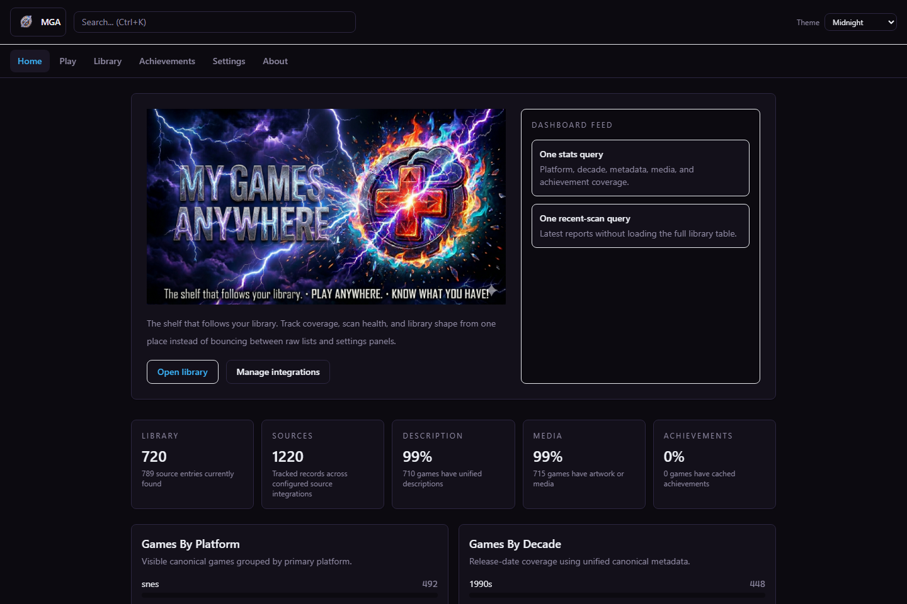

# MyGamesAnywhere (MGA)

**MyGamesAnywhere is a local-first game launcher and unified game library for Steam, Xbox, Epic, emulators, cloud streaming, network shares, removable drives, and mixed-platform collections.**

MGA scans the sources you choose, merges duplicate entries into one canonical game, enriches them with metadata and media, and gives you one place to see what you own, what you can play, and where it actually lives.

[Download for Windows](https://github.com/GreenFuze/MyGamesAnywhere/releases/tag/v0.0.5) · [Website](https://greenfuze.github.io/MyGamesAnywhere/) · [Screenshots](#screenshots) · [Quick Start](#try-mga-in-30-seconds) · [Roadmap](roadmap.md)

**Current release line:** `v0.0.5`  
**Status:** pre-1.0, actively moving, local-first by design

## Why people use MGA

- One library across stores, ROMs, network shares, removable drives, and cloud catalogs
- Canonical merge instead of duplicate launcher rows
- Local-first data ownership: your database, config, and media stay on your machine unless you choose to sync
- Manual review and re-detect when automatic matching fails
- Achievements, source provenance, media, and metadata in one place
- Browser-play and emulator-aware workflows for supported runtimes

## Try MGA in 30 seconds

1. Download the latest Windows portable ZIP from [Releases](https://github.com/GreenFuze/MyGamesAnywhere/releases/tag/v0.0.5)
2. Extract it to a writable folder
3. Run `Start MGA.cmd`
4. Open [http://127.0.0.1:8080](http://127.0.0.1:8080)

The packaged release is currently a **Windows portable build**. MGA runs locally and binds to `127.0.0.1` by default.

## Screenshots

### Home and library overview

MGA starts with a product view of your library, scans, and integrations instead of pushing one storefront first.

### Platform shelves and poster-first browsing

Platform shelves stay focused on browsable collections with loaded cover art, source provenance, and clean metadata.

### Game detail page

Each game gets one canonical detail page with metadata, files, sources, media, actions, and achievements.

### Settings and integrations

Sources, metadata providers, achievements, sync targets, and runtime surfaces are managed from one local settings flow.

## MGA vs traditional launchers

| Capability | MGA | Typical store launcher |
|---|---|---|
| Merge the same game across multiple sources | Yes | Usually no |
| Works with ROMs and emulators | Yes | Usually no |
| Detects games on network shares and removable drives | Yes | Rare |
| Local-first data ownership | Yes | Often no |
| Source-level provenance | Yes | Rare |
| Manual review when detection fails | Yes | Rare |
| Web UI and local API on the same local server | Yes | Rare |

## Available now

- Unified cross-source library with canonical game merge
- Local-first runtime with SQLite, local media, and plugin-driven integrations
- Manual review, search, and re-detect for undetected games
- Poster-first library and game pages
- Achievements dashboard backed by cached integration data
- Browser-play support for configured runtimes such as EmulatorJS, js-dos, and ScummVM
- Save-sync and settings-sync surfaces
- Tagged Windows portable releases

## In active development

- Packaging hardening beyond the first Windows portable release
- Game page and card UX iteration
- More metadata and runtime coverage
- Broader installer and upgrade-safe packaging flow

## Planned later

- Multi-user / user management
- Cross-source user file and profile view
- Cross-platform installers
- Windows desktop client
- Mobile client

## Available integrations

| Integration | Plugin ID(s) | What MGA uses it for | Config / notes |
|---|---|---|---|
| Steam | `game-source-steam`, `metadata-steam` | Game source, Steam metadata lookup, Steam achievements | Steam Web API key for source and achievements |
| Xbox / PC Game Pass | `game-source-xbox` | Xbox library source, Game Pass / xCloud availability, Xbox achievements | OAuth-backed source and achievement flow |
| Epic Games | `game-source-epic` | Epic library source | Source listing |
| Google Drive | `game-source-google-drive`, `save-sync-google-drive`, `sync-settings-google-drive` | Drive-backed game source, file browse/materialize/delete, save sync, settings sync | OAuth-backed; source config supports include paths |
| SMB / network shares | `game-source-smb` | Network-share game source and filesystem operations | Host/share credentials and include paths |
| Local disk | `save-sync-local-disk` | Local save-sync target | No external service required |
| LaunchBox | `metadata-launchbox` | Game metadata lookup, platform-aware matching, media enrichment | Bundled metadata provider |
| IGDB | `metadata-igdb` | Game metadata lookup and enrichment | Twitch/IGDB client ID and secret |
| RAWG | `metadata-rawg` | Game metadata lookup and enrichment | RAWG API key |
| GOG | `metadata-gog` | GOG metadata lookup | Metadata provider |
| HLTB | `metadata-hltb` | HowLongToBeat metadata lookup | Metadata provider |
| MAME DAT | `metadata-mame-dat` | Arcade/MAME metadata lookup | Metadata provider |
| RetroAchievements | `retroachievements` | RetroAchievements metadata lookup and achievements | API key and username |

## Why MGA is different

Most launchers are store-first. MGA is **library-first**.

That means:

- your collection is not reduced to one storefront
- ROMs, ripped media, cloud catalogs, and installed PC games can live in the same library
- metadata, achievements, media, and source provenance are visible together
- your data stays local unless you choose to sync it
- detection failures stay visible and fixable instead of disappearing into a bad match

## Who MGA is for

MGA is for you if you:

- own games across multiple storefronts
- use emulators or maintain ROM collections
- keep games on external drives, NAS, or SMB shares
- want local-first control over metadata and media
- care about provenance, cleanup, and collection quality

## Feature status

| Area | Status | What it means |
|---|---|---|
| Unified cross-source library | Available | MGA merges source entries into canonical games instead of leaving you with duplicate launcher rows. |
| Local-first runtime | Available | SQLite, media, config, and plugins run locally. |
| Metadata enrichment | Available | LaunchBox, IGDB, RAWG, HLTB, Steam, GOG, MAME DAT, and similar provider paths feed the library. |
| Manual review + re-detect | Available | Undetected games can be reviewed, searched, and re-run through the detection flow. |
| Browser play runtimes | Available | Supported runtimes such as EmulatorJS, js-dos, and ScummVM can launch directly from the web UI where configured. |
| Achievements dashboard | Available | MGA exposes cached achievements across supported integrations and per-game detail views. |
| Save-sync migration flows | Available | Save sync jobs and migration status are exposed through the app and API. |
| REST API + web UI | Available | MGA exposes a first-party API and a React frontend on top of the same local server. |
| Portable Windows release packages | Available | MGA now has a Windows-first portable packaging and tagged-release flow built around `vX.Y.Z` releases. |
| Cross-platform installers | Planned | Proper install paths, prerequisites, and upgrade flow will follow after portable packages. |
| Windows desktop client | Planned | A dedicated desktop shell/client is intended beyond the current tray-first server experience. |
| Mobile client | Planned | Mobile browsing and companion flows are planned after packaging and desktop hardening. |
| Multi-user / user management | Planned | Separate users, user-aware libraries, and server-side identity are still ahead. |
| Cross-source user file/profile view | Planned | MGA should eventually understand user identity, ownership, and progression across multiple source accounts. |

## FAQ

### Can MGA combine Steam, Xbox, Epic, and emulator games in one library?

Yes. MGA is built around a canonical game model that merges source entries into one game where the detection flow can prove the relationship.

### Does MGA work offline?

Yes for the local runtime. MGA is local-first and runs a local Go server plus web UI on your machine. Some integrations and metadata providers naturally require network access.

### Where does MGA store my data?

The current runtime is portable and working-directory-based. Config, database, plugins, and media live with the MGA runtime unless a specific sync integration is configured.

### Does MGA support ROMs and emulators?

Yes. MGA is explicitly built to include emulator and ROM-style workflows alongside storefront and cloud-source workflows.

### Can MGA detect games on network shares and removable drives?

Yes. That is part of the core design, not an afterthought.

### Does MGA expose an API?

Yes. MGA exposes a local REST API and the web UI runs on top of the same local server.

## Packaging, versioning, and upgrades

MGA now carries a repository version source at [`VERSION`](VERSION). The current line is **`0.0.5`**.

Release policy:

- releases are tagged as **`vX.Y.Z`**
- the root `VERSION` file is the default source of truth for packaging and build metadata
- pre-1.0 releases can still evolve quickly, but every tagged release should carry explicit upgrade notes

Upgrade policy:

- upgrades must not silently discard user data
- schema changes should be additive and idempotent where possible
- releases that change runtime layout, schema behavior, or sync payload expectations must ship with migration notes
- until installers exist, upgrades assume a portable replacement flow with backup guidance for `config.json`, `data/`, and `media/`

Detailed notes live in [docs/releases-and-upgrades.md](docs/releases-and-upgrades.md).

## Repo layout

| Path | Purpose |
|---|---|
| [`server/`](server/) | Go server, plugins, database layer, API, build scripts |
| [`server/frontend/`](server/frontend/) | React/Vite frontend |
| [`docs/`](docs/) | branding, screenshots, Pages site, and project docs |
| [`roadmap.md`](roadmap.md) | active roadmap and future work |

## Contributing

MGA is still tightening architecture, packaging, and product shape. If you contribute, prefer work that is:

- conservative with user data
- explicit about migrations and blast radius
- aligned with the local-first model
- honest about current vs planned behavior

## License

License and contribution policy can be finalized once packaging and release flow are locked in.
