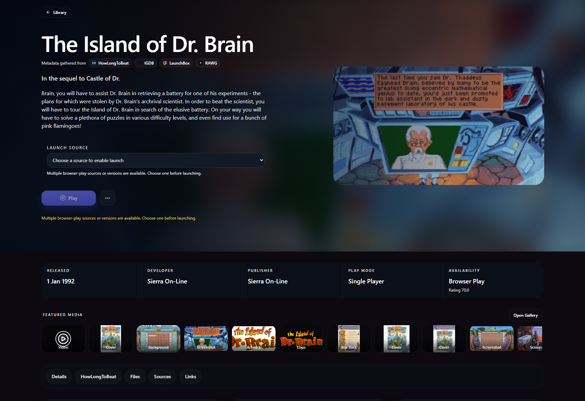
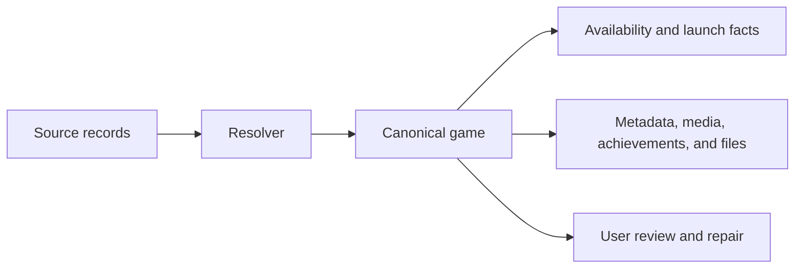
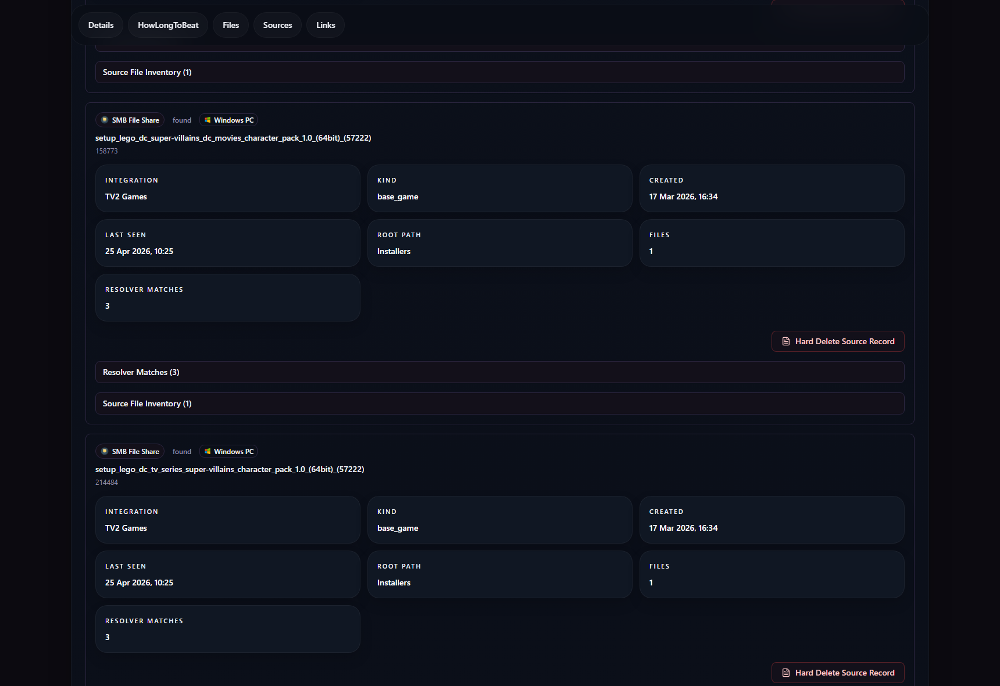
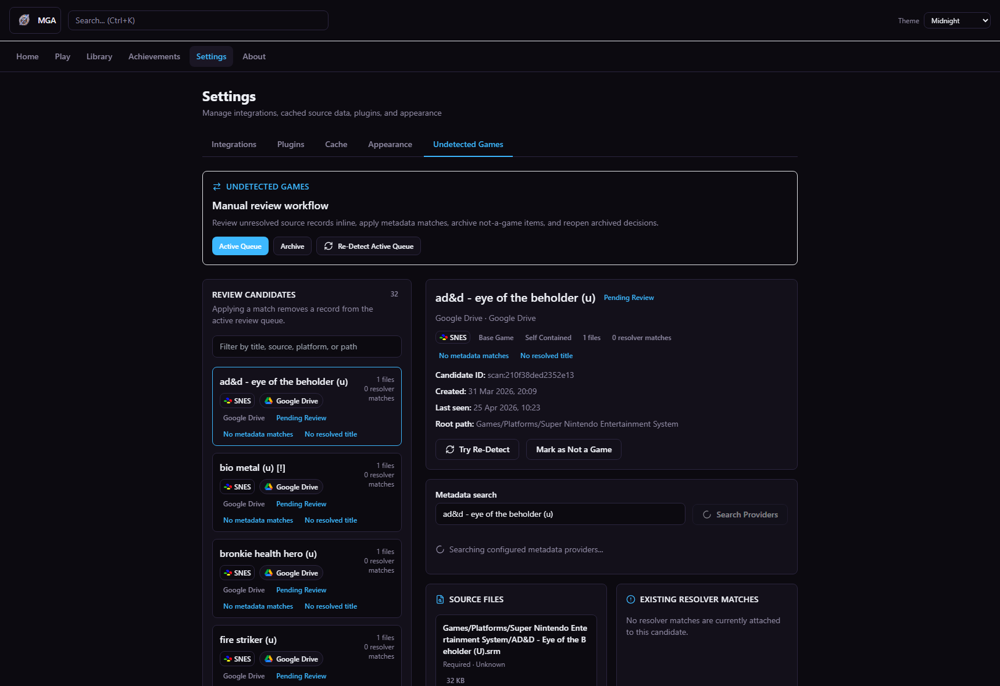
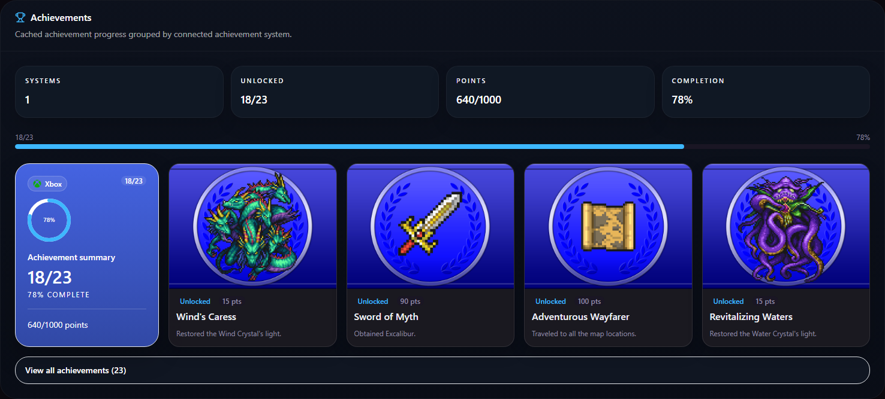
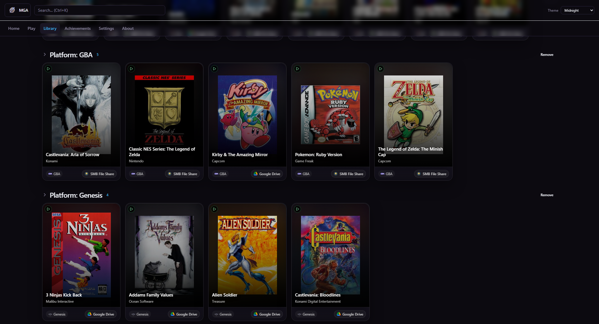
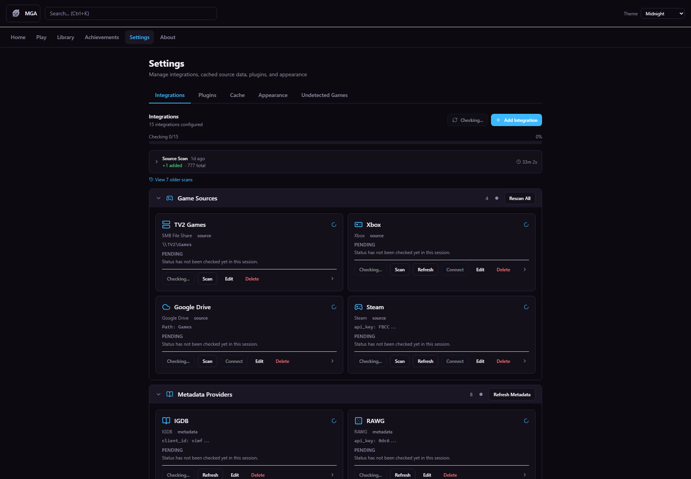
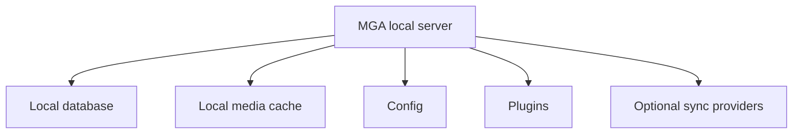

# MyGamesAnywhere (MGA)

## One canonical game library for every place your games live.

**MGA is a local-first game launcher and game collection manager that merges storefronts, ROMs, cloud runtimes, files, metadata, media, and achievements into source-backed canonical game pages that stay local by default.**

Most launchers start from a storefront or a folder. MGA starts from the game identity. Every detected source, provider match, file location, achievement system, and runtime remains visible, so you can understand, launch, fix, and curate the game instead of trusting a hidden match.

[Download for Windows](https://github.com/GreenFuze/MyGamesAnywhere/releases/latest) · [View screenshots](#screenshots) · [GitHub Pages](https://greenfuze.github.io/MyGamesAnywhere/) · [GitHub](https://github.com/GreenFuze/MyGamesAnywhere) · [Public roadmap](docs/public-roadmap.md)

**Current release line:** `v0.0.7`
**Status:** pre-1.0, actively moving, local-first by design

*A source-backed canonical game page: one page combines metadata, launch availability, media, files, source-backed navigation, and provider evidence around a single canonical game.*

## Why MGA exists

Real game collections are fragmented by default. One library can span:

- Steam
- Xbox / PC Game Pass
- Epic
- GOG purchases and installers
- ROM sets
- emulator runtimes
- xCloud and browser-play runtimes
- source-backed save sync
- SMB / NAS shares
- removable drives
- metadata providers
- achievement systems
- local installer files and loose game data

If you are looking for a **local-first game launcher**, **unified game library**, **Steam Xbox Epic ROM launcher**, **emulator and ROM library manager**, **Game Pass and xCloud launcher**, **self-hosted game library**, or a **Playnite alternative** / **LaunchBox alternative** that makes provenance visible, MGA is aimed at that harder problem.

## What Makes MGA Different

- **Canonical game merge**: MGA merges many source records, provider matches, media items, files, and runtime facts into one canonical game instead of leaving you with duplicate rows.
- **Source-backed versions**: A canonical game can keep multiple concrete versions/platforms under one page, with per-version play options and achievement sets.
- **Source provenance**: Storefront imports, ROM records, network-share records, metadata matches, resolver output, and provider IDs remain inspectable as evidence, not hidden importer magic.
- **Local-first ownership**: The database, config, plugins, and media cache live on your machine unless you explicitly configure sync integrations.
- **Manual review and repair**: Detection failures stay visible. MGA exposes unresolved records, lets you search providers again, re-detect, apply a match, or archive a false positive.

## The Problem

Typical launchers are good at one store, one account, or one folder at a time. Real collections are messier:

- the same game can show up from multiple sources
- one source may only know the raw filename while another knows the storefront title
- launch availability can differ from metadata availability
- achievements may live on a different system than the best metadata match
- DLC installers, ROM roots, cloud launch flags, and network paths all describe the same game from different angles

MGA is built for that fragmentation instead of pretending it does not exist.

## The MGA Model

The pipeline is straightforward:

1. Source integrations discover source records and files.
2. The resolver tries to identify what game those records represent.
3. MGA creates or updates a canonical game.
4. Runtime availability, metadata, media, achievements, and files attach to that canonical game.
5. If the result is uncertain, MGA exposes the record for manual review instead of silently burying it.

## Source-Backed Canonical Game Pages

The game page is the centerpiece of MGA. A good canonical game page should tell you:

- what the game is
- where MGA found it
- where it can run
- which providers contributed metadata
- which source records matched
- what files and media are attached
- what achievements are known
- which version/source each achievement set belongs to
- what can be manually fixed if detection was wrong

That is the core differentiator. MGA is not just a prettier launcher row. It is a source-backed game identity layer over a messy local game library.

## Screenshots

### Canonical game page

*A source-backed canonical game page: one page combines metadata, launch availability, media, files, source-backed navigation, and provider evidence around a single canonical game.*

### Provenance and source records

*Provenance stays visible: MGA shows which source records, integrations, files, and resolver counts contributed to the canonical game.*

### Manual review and repair

*Detection failures stay fixable: unresolved source records remain reviewable, searchable, and repairable instead of disappearing into a bad automatic match.*

### Achievements and progress

*Progress follows the canonical game page, not just one store row: achievement summaries and known unlocks stay attached to the game.*

### Mixed-source library

*Storefronts, ROMs, cloud-ready entries, and file-backed records can live in one local game library instead of separate tools.*

### Integrations as control surface

*Integrations are explicit and local: sources, metadata providers, achievements, and sync surfaces are visible control surfaces, not hidden importer state.*

TODO screenshot: capture a canonical game page with at least 3 source/provider records visible in the same frame.  
TODO screenshot: capture a mixed library view with visible storefront, ROM, and cloud-ready entries in one screenshot.  
TODO screenshot: capture a cross-system achievement example with Steam, Xbox, and RetroAchievements visible in one proof set.

## MGA vs Traditional Launchers

| Capability | MGA | Typical store launcher | Typical ROM frontend |
|---|---|---|---|
| Canonical merge across stores, ROMs, cloud, and files | Core model | Usually no | Usually no |
| Source provenance per game | Visible by design | Rare | Rare |
| Local-first database, media, and config | Yes | Often no | Usually local, but narrower scope |
| Manual review when detection fails | Explicit workflow | Rare | Varies |
| Game page with metadata, media, achievements, files, and source records | Yes | Partial | Partial |
| SMB / NAS / removable drive awareness | Core scenario | Rare | Sometimes |
| Browser / cloud / runtime launch flows | Available where configured | Limited | Runtime-specific |
| REST API over the same local library | Yes | Rare | Rare |

## Available Now

- Unified cross-source library with canonical game merge
- Source-backed game pages with metadata, media, files, external links, provider evidence, favorites, and per-version context
- Manual review, fuzzy provider search, platform-aware matching, and re-detect for unresolved records
- Poster-first library browsing and game pages
- Favorite games persisted by the local server, including automatic Favorites shelves in Library and Play
- Source-backed Steam, Xbox, and RetroAchievements progress surfaces, including multiple achievement sets when one canonical game has multiple detected versions
- Browser-play support for configured runtimes such as EmulatorJS, js-dos, and ScummVM, with source-backed launch options
- Materialized browser play for Drive and SMB-backed game files so network/cloud sources can be cached locally before launch
- Game Pass / xCloud availability surfaced through Xbox-backed data where available
- EmulatorJS-native save-sync hooks backed by a local server cache and optional sync providers
- Save-sync and settings-sync surfaces
- Configurable server `LISTEN_IP` for loopback or opt-in LAN binding, while released packages stay local-only by default
- Plugin-backed dry-delete previews for file-backed source deletes, with checkbox confirmation before the real delete action
- REST API and React web UI running on the same local server
- Windows portable and installer release packaging

## In Active Development

- Packaging hardening beyond the first Windows installer release
- Game page and card UX iteration
- More metadata and runtime coverage
- Broader upgrade-safe packaging flow
- Better screenshot, comparison, and release-note proof for public docs

## Planned Later

- Multi-user / user management
- Cross-source user file and profile view
- Cross-platform installers
- Windows desktop client
- Mobile client

## Integrations

### Game sources

| Integration | Plugin ID(s) | What MGA uses it for | Config / notes |
|---|---|---|---|
| Steam | `game-source-steam` | Game source discovery, Steam-backed achievements | Steam Web API key |
| Xbox / PC Game Pass | `game-source-xbox` | Xbox library source, Game Pass / xCloud availability, Xbox achievements | OAuth-backed |
| Epic Games | `game-source-epic` | Epic library source | Source listing |
| Google Drive | `game-source-google-drive` | Drive-backed game source, file browse/materialize/delete, browser-play materialization | OAuth-backed; include paths supported; source deletes move explicit files to Drive trash |
| SMB / network shares | `game-source-smb` | Network-share game source, filesystem operations, browser-play materialization | Host/share credentials and include paths; source deletes remove only explicit files |

### Metadata providers

| Provider | Plugin ID(s) | What MGA uses it for | Config / notes |
|---|---|---|---|
| LaunchBox | `metadata-launchbox` | Metadata lookup, platform-aware matching, media enrichment | Bundled metadata provider |
| IGDB | `metadata-igdb` | Metadata lookup and enrichment | Twitch/IGDB client ID and secret |
| RAWG | `metadata-rawg` | Metadata lookup and enrichment | RAWG API key |
| GOG | `metadata-gog` | Metadata lookup | Metadata provider |
| HowLongToBeat | `metadata-hltb` | Completion-time lookup | Metadata provider |
| MAME DAT | `metadata-mame-dat` | Arcade / MAME metadata lookup | Metadata provider |
| Steam metadata | `metadata-steam` | Steam metadata lookup | Works with Steam-backed catalog data |

### Achievement providers

| Provider | Plugin ID(s) | What MGA uses it for | Config / notes |
|---|---|---|---|
| Steam | `game-source-steam` | Steam-backed achievement progress | Steam Web API key |
| Xbox | `game-source-xbox` | Xbox-backed achievement progress | OAuth-backed |
| RetroAchievements | `retroachievements` | RetroAchievements metadata and source-backed achievement sets | API key and username |

### Runtime / launch providers

- Built-in browser-play surfaces for configured **EmulatorJS**, **js-dos**, and **ScummVM** runtimes
- Server-provided launch options for concrete source/version selection
- Local materialization for remote/network-backed browser play where required
- EmulatorJS-native save-state and save-RAM sync through MGA save-sync integrations
- Xbox-backed **xCloud** launch availability where the connected source exposes it

### Storage / sync providers

| Provider | Plugin ID(s) | What MGA uses it for | Config / notes |
|---|---|---|---|
| Local disk | `save-sync-local-disk` | Local save-sync target | No external service required |
| Google Drive | `save-sync-google-drive`, `sync-settings-google-drive` | Save sync and settings sync | OAuth-backed; EmulatorJS saves are cached locally before cloud upload |

## Install / Download

MGA ships Windows portable and installer builds. It runs as a local server plus web UI on your machine and binds to `127.0.0.1:8900` by default.

1. Download the portable ZIP or installer EXE from [Releases](https://github.com/GreenFuze/MyGamesAnywhere/releases/latest)
2. For portable, extract it to a writable folder such as `C:\Games\MGA` and run `Start MGA.cmd`
3. For the installer, choose per-user or all-users install, then choose user-process or Windows-service runtime mode
4. Open [http://127.0.0.1:8900](http://127.0.0.1:8900)

The current portable runtime stores config, database, plugins, media, and local state beside the runtime folder. Avoid extracting it under `Program Files`. The shipped `config.json` includes `LISTEN_IP: "127.0.0.1"` and `PORT: "8900"`; LAN exposure is opt-in by editing the server config.

### Local-first ownership

MGA behaves more like a **self-hosted game library** running on your own machine than a cloud-first launcher account.

## FAQ

### Is MGA a Playnite alternative?

It can be, depending on what you care about. If you mainly want a polished storefront launcher shell, Playnite may still be the closer fit today. If you want a **source-backed game launcher** focused on canonical merge, provenance, manual repair, and a local web/API surface, MGA is aimed at that harder library problem.

### Is MGA a LaunchBox alternative?

Partly. MGA overlaps with LaunchBox-style metadata and mixed-library organization, but its differentiator is not themeing or cabinet presentation. MGA is focused on canonical identity, visible resolver evidence, local ownership, and repairable detection.

### Does MGA replace Steam, Xbox, or Epic?

No. MGA sits above those systems as a local library and launcher layer. It uses connected sources and provider data; it does not replace the services themselves.

### Does MGA store my data locally?

Yes. MGA is local-first. The database, config, plugins, and media cache live on your machine unless you configure sync integrations.

### Can MGA handle ROMs and emulators?

Yes. ROM and emulator-style collections are first-class scenarios, not afterthoughts.

### What happens when detection is wrong?

MGA keeps unresolved or questionable records visible in the manual review flow. You can re-detect, search configured metadata providers with broader fuzzy/platform-aware matching, apply a better match, or mark an item as not a game.

### Can I delete false-positive source files from manual review?

Yes, for file-backed sources. MGA asks the source plugin for a dry-delete preview first, shows the exact plugin-returned items, and requires a checkbox confirmation before the real delete button is enabled. Google Drive files are moved to Drive trash; SMB files are permanently deleted only when they are explicit file targets.

### Can I inspect where a game came from?

Yes. Canonical pages keep source records, files, root paths, resolver matches, provider links, and other provenance visible.

### Does MGA expose an API?

Yes. MGA exposes a local REST API and a React frontend over the same local library.

## Roadmap

The short public roadmap lives in [docs/public-roadmap.md](docs/public-roadmap.md). The detailed engineering log remains in [roadmap.md](roadmap.md).

The important split is:

- **Available now**: canonical game merge, local-first runtime, source-backed pages, favorites, platform-aware manual review, source-backed achievements, browser-play surfaces, EmulatorJS save-sync, safer file-backed delete previews, configurable listen IP, and Windows portable/installer packaging
- **In active development**: packaging hardening, UX refinement, broader metadata/runtime coverage, and better public proof/docs
- **Planned later**: Linux packaging, desktop shell, mobile client, and deeper multi-user flows

## Release And Upgrade Safety

MGA carries a repository version source at [`VERSION`](VERSION). The current line is **`0.0.7`**.

Upgrade policy:

- upgrades must not silently discard user data
- schema changes should be additive and idempotent where possible
- releases that change runtime layout, schema behavior, or sync payload expectations must ship with migration notes
- file-backed destructive actions should preview source-plugin targets before deletion and require explicit confirmation
- installed updates download and verify the installer before launching it; portable updates remain a checked/downloaded manual replacement flow

Windows installer packaging uses Inno Setup, which is distributed under its own license terms. MGA preserves Inno Setup attribution in NOTICE and package documentation.

Detailed notes live in [docs/releases-and-upgrades.md](docs/releases-and-upgrades.md).

## Contributing

MGA is still tightening architecture, packaging, and product shape. If you contribute, prefer work that is:

- conservative with user data
- explicit about migrations and blast radius
- aligned with the local-first model
- honest about current vs planned behavior

## License

MGA is licensed under the [Apache License 2.0](LICENSE.md).
