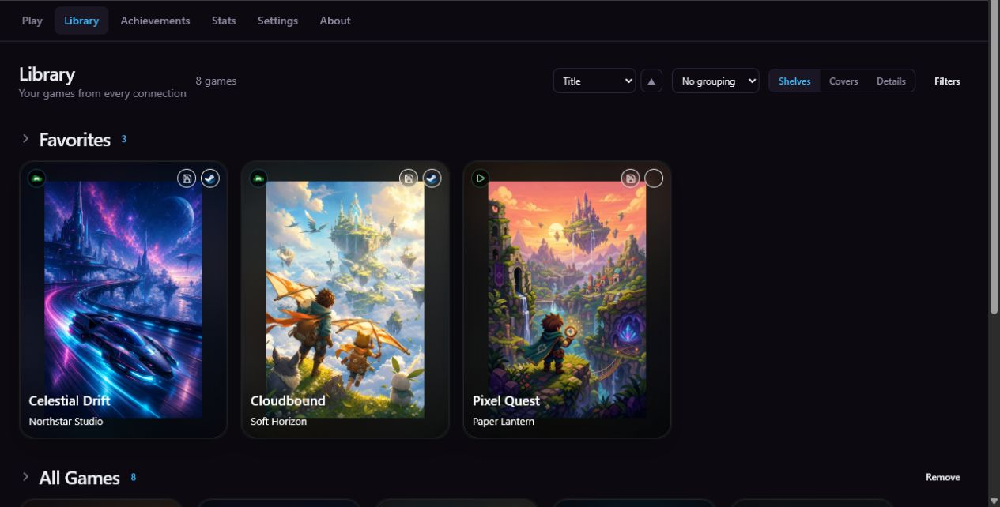
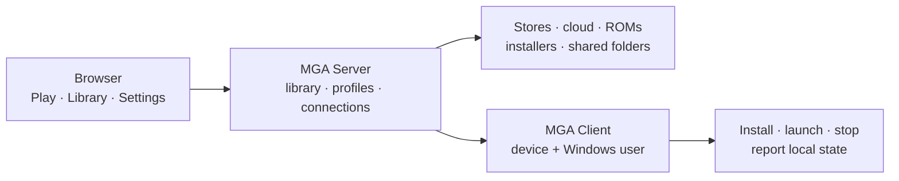
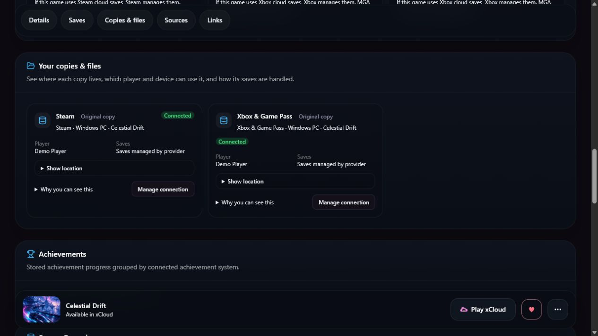

# MyGamesAnywhere (MGA)


## Your games, one place to play

MGA brings together games from stores, subscriptions, ROM collections, installers, shared folders, and cloud services. Open it in a browser, choose a game, and see every available way to play—on this PC, in the browser, or on another device.

Unlike a launcher that flattens every import into one anonymous row, MGA keeps each copy, edition, platform, and source honest. That means an Xbox copy and a Steam copy can appear together without losing their own install state, achievements, play options, or saves.

[Download for Windows](https://github.com/GreenFuze/MyGamesAnywhere/releases/latest) · [Install guide](https://greenfuze.github.io/MyGamesAnywhere/install.html) · [Screenshots](https://greenfuze.github.io/MyGamesAnywhere/screenshots.html) · [Project website](https://greenfuze.github.io/MyGamesAnywhere/)

> MGA is pre-1.0 software under active development. The latest version is listed in [`VERSION`](VERSION).



## Why MGA?

Your collection is probably bigger than one storefront:

- Steam, Xbox, PC Game Pass, Epic, and GOG
- local games, installers, ROMs, and emulators
- xCloud and in-browser play
- NAS, SMB, Google Drive, and removable storage
- achievements, artwork, and save files from different services

MGA gives that collection one web interface while preserving the details that matter.

### One game, every way to play

A game can have several playable copies and routes. MGA can show the installed version as the default action while keeping Steam, Xbox, xCloud, browser emulation, and other configured options in the Play menu.

### Copies stay honest

Regional ROMs, remasters, storefront editions, DLC, and similarly named games are not interchangeable. MGA groups related entries for browsing without erasing the concrete copy and source underneath.

### Your devices work together

The MGA Server owns the library and web interface. A small per-user MGA Client performs trusted work on each device: installing, launching, stopping, and reporting local state. One client can connect to more than one MGA Server, with ownership boundaries that prevent servers from silently managing each other's files.

### Local-first, profile-separated

The server database, media, configuration, client bindings, and managed installs remain under your control. Each MGA profile owns its connections, credentials, library state, favorites, and achievements. Optional sync and cloud connections are explicit.

### Problems come with a next step

When MGA cannot identify a game, refresh a connection, or complete an install, it keeps the problem visible and provides a repair action instead of silently hiding it.

## Available today

- A unified Library and play-first home page
- Profile-owned Steam, Xbox, Google Drive, SMB, ROM, and local-file connections
- Multiple copies, versions, platforms, and play options per game
- Local installs with separate download and installation progress
- Per-user Windows device clients with normal or elevated launch
- Browser play with supported runtimes such as EmulatorJS, js-dos, and ScummVM
- xCloud availability when supplied by an Xbox connection
- Provider-aware achievements and refresh status
- Save-sync foundations with explicit compatibility boundaries
- Manual review, split, merge, re-detect, and duplicate cleanup tools
- Automatic library rescans and actionable notification history
- Windows portable and installer packages with verified updates
- Optional LAN access from phones, TVs, and other computers

See the [feature guide](https://greenfuze.github.io/MyGamesAnywhere/features.html) for the product model and the [connections page](https://greenfuze.github.io/MyGamesAnywhere/integrations.html) for current integration details.

## Quick start on Windows

1. Download the latest MGA Server package from [GitHub Releases](https://github.com/GreenFuze/MyGamesAnywhere/releases/latest).
2. Run the installer. Choose **For me only** for a personal server or **All users** for an always-on LAN server.
3. Open MGA in your browser and create the first admin profile.
4. Add your game connections in **Settings → Connections**.
5. Download the MGA Client from the device control in MGA and install it for each Windows user who needs local play or installs.
6. Pair that client with the MGA Server. You can run it normally or explicitly as administrator when a task needs elevation.

Portable builds are also available. Read the [full install guide](https://greenfuze.github.io/MyGamesAnywhere/install.html) before exposing MGA on a LAN.

## How it fits together


```mermaid
flowchart LR
  UI["Browser<br/>Play · Library · Settings"] --> SERVER["MGA Server<br/>library · profiles · connections"]
  SERVER --> SOURCES["Stores · cloud · ROMs<br/>installers · shared folders"]
  SERVER --> CLIENT["MGA Client<br/>device + Windows user"]
  CLIENT --> ACTIONS["Install · launch · stop<br/>report local state"]
```

- **MGA Server** is the source of truth for profiles, connections, game identity, play options, and device commands.
- **Web interface** is the primary product UI and works locally or across a trusted LAN.
- **MGA Client** runs once per device/OS-user pair and performs work a browser cannot safely do.
- **Plugins** discover games, metadata, achievements, saves, and runtime capabilities.

Technical architecture, protocols, ADRs, and migrations are versioned under [`docs/architecture`](docs/architecture/README.md). Current product and operating guidance lives in the [MGA Confluence space](https://greenfuzer.atlassian.net/wiki/spaces/MG/overview).

## A game keeps its real copies



MGA can group two copies for browsing while still showing their different stores, play methods, achievements, and save ownership. The screenshots use an isolated fictional library generated by [`server/cmd/publicdemo`](server/cmd/publicdemo/main.go); they never contain a contributor's real profile or collection.

## Development

The repository contains the Go server, React web interface, plugins, and Windows MGA Client. Start with [`AGENTS.md`](AGENTS.md) and [`docs/agent-bootstrap.md`](docs/agent-bootstrap.md).

```powershell
go test ./...
cd web
npm ci
npm run build
```

Open work, priorities, and progress are tracked in the [MGA Jira project](https://greenfuzer.atlassian.net/jira/software/c/projects/MGA/boards/69/backlog).

## License

See [`LICENSE`](LICENSE).
