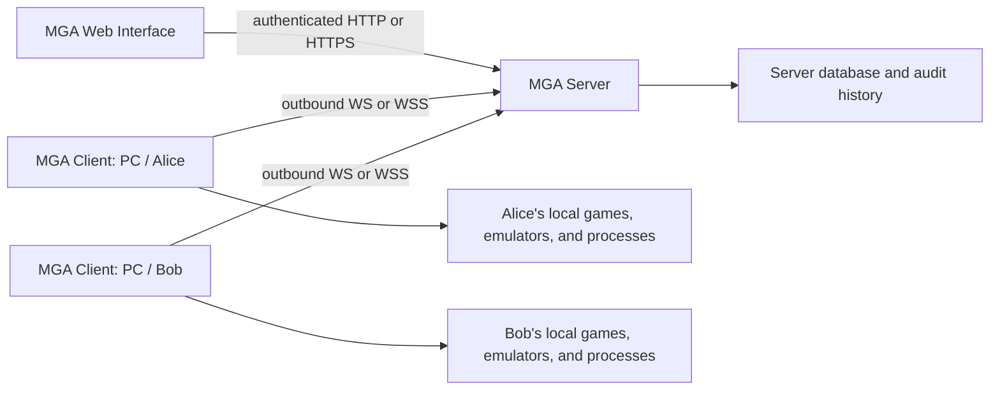

# ADR-0001: Web Control Plane and Per-User MGA Client

- **Status:** Accepted
- **Date:** 2026-07-13
- **Decision owners:** MGA maintainers

## Context

MGA is moving away from a desktop application. The React web interface should
remain the main user experience, but a browser cannot safely perform privileged
or machine-local work such as installing games, controlling emulators, or
managing local processes.

A custom `mga://` protocol handler alone would only provide one-way launch
requests. It would not provide durable identity, authorization, presence,
progress, cancellation, or reliable command results. MGA therefore needs a
device agent that participates in the product as a first-class endpoint.

## Decision

MGA will consist of three independently bounded runtime components:

1. **MGA Server** is the control plane. It owns authenticated sessions, endpoint
   registration, authorization, command orchestration, audit history, and the
   canonical library.
2. **MGA Web Interface** is the user interface. It talks only to the server and
   never receives a device credential or directly exposes a privileged local
   API.
3. **MGA Client** is a per-OS-user device agent and CLI. It connects outbound to
   the server, advertises capabilities and state, and executes typed commands
   after server authorization.

The former desktop application is not part of the new architecture. Native UI
should only be introduced later for a narrowly justified OS interaction, not
as another application shell.



## Endpoint identity

The command target is a **device endpoint**, not only a physical computer. One
endpoint represents this tuple:

```text
physical host context + OS user + MGA Client installation
```

The endpoint receives a random, server-recognized `endpoint_id`. A second OS
user on the same computer runs a separate client instance, has separate local
credentials, and appears as a separate endpoint. Reinstalling or explicitly
resetting the client may also create a new endpoint.

Cross-user physical-host correlation is not an authorization boundary. A
per-user process cannot reliably establish shared machine identity without
machine-wide storage or elevated installation. The server may later group
endpoints using display metadata such as host name and platform facts, but
permissions always target the endpoint ID.

The client runs without permanent administrator rights and is not a Windows
service. An individual command that needs elevation must report that user
interaction is required. It cannot silently approve its own elevation.

## Profile-to-endpoint authorization

MGA uses an explicit many-to-many grant between an authenticated MGA profile
and a device endpoint. Pairing creates an `Owner` grant for the profile that
completed pairing. Other profiles have no access until an owner grants it.

The initial access levels are:

| Level | Intended authority |
|---|---|
| `View` | See endpoint presence, capabilities, and non-sensitive inventory |
| `Play` | View plus launch and stop permitted games |
| `Manage` | Play plus install, uninstall, scan, and emulator management |
| `Owner` | Manage plus rename, share, revoke, re-pair, and endpoint administration |

Authorization is enforced by the server before dispatch and by the client
against the signed/validated command context. UI visibility is not an
authorization control.

Remote device control requires real authenticated web sessions. The current
convenience-profile behavior must not be treated as sufficient authentication
for commands that affect another machine or OS user.

## Presence and display state

The web interface derives endpoint state from server-observed connections,
heartbeats, version compatibility, capabilities, and active work:

| Color | State | Meaning |
|---|---|---|
| Green | Ready | Connected, compatible, and ready for commands |
| Amber | Busy | Connected and performing work or awaiting local interaction |
| Gray | Offline | No live client connection |
| Purple | Update required | Connected, but normal commands are blocked by compatibility policy |
| Red | Error | Connected or recently connected with an actionable failure |

Color is always paired with a text label and reason. It is not the only status
signal.

## Transport and command model

- The client establishes an outbound WebSocket connection to the server.
- HTTP/WS is supported on a trusted LAN to avoid requiring locally trusted
  certificates on every browser and client host. HTTPS/WSS remains supported
  and is strongly recommended on any network that is not fully trusted. MGA
  must not be exposed directly to the internet over HTTP because credentials,
  session cookies, pairing data, and device traffic are not transport encrypted.
- The browser never connects directly to the client.
- `mga://` is limited to pairing, wake-up, and recovery entry points. It is not
  the normal command transport and never carries a reusable credential.
- Commands are typed, versioned, authorized, time-bounded, and idempotent where
  they mutate local state.
- MGA will not implement a general remote shell or arbitrary executable command.
- Interactive v1 commands fail fast when the endpoint is offline; they are not
  silently queued for later execution.

## MGA Client technology stack

The MGA Client uses:

| Concern | Decision |
|---|---|
| Language | Go, initially using the same `go 1.25.0` language baseline as the server |
| Binary | One `mga-client` executable containing the agent and CLI commands |
| CLI | Cobra without Viper |
| Network | `net/http`, JSON, and `github.com/coder/websocket` |
| Local state | Versioned JSON schema 1 for pairing metadata; SQLite is deferred until durable mutating-command/idempotency state is introduced |
| Windows secrets | DPAPI, scoped to the current OS user |
| Local IPC | None in the foundation; a per-user named pipe requires a concrete local-control use case |
| OS integration | `golang.org/x/sys/windows` behind platform interfaces and build tags |
| Logging | Human-readable fail-fast CLI output; bounded structured agent logs remain packaging work |
| Windows installer | Inno Setup, per-user and non-elevated by default |
| Testing | Go tests, protocol contract tests, fake platform adapters, and Windows integration tests |

Go services use explicit object boundaries and constructor injection. The
implemented foundation separates the CLI `Application`, client `Service`,
`Agent`, configuration and identity stores, single-instance platform adapter,
server device `Service`, connection `Hub`, persistence store, and HTTP
controllers. Typed inventory, platform action, and update services are added
only with their command families.

Configuration and dependency construction fail fast. Unsupported schemas,
corrupt state, unavailable secure storage, and duplicate agent instances must
produce explicit diagnostics rather than silently resetting data.

## Repository boundary

The MGA Client is a standalone top-level component under `client/`. It must not
be placed under `server/` or `server/frontend/`.

```text
client/
  cmd/mga-client/
  internal/
  migrations/
  installer/
  go.mod

protocol/
  device/v1/
  go.mod

server/
  ...
```

`protocol/` will be a small, dependency-light module containing versioned wire
contracts shared by the server and client. The client must not import
`server/internal/...`; server implementation details must not leak across the
component boundary.

The client has an independent release version, installer, update manifest, and
compatibility policy. Server and client may ship together, but neither release
lifecycle assumes that their versions are identical.

## Local persistence and updates

The client keeps non-secret pairing settings in a versioned JSON configuration
and device private material in a DPAPI-protected store. Secrets are not written
to plain JSON. Durable SQLite operational state is required before the first
mutating/idempotent command family ships.

All client persistence begins with explicit schema versions. Changes to
persisted SQLite data or JSON/config require a versioned migration. A client
must stop with a clear error when it sees a newer unsupported schema.

Client updates use a client-specific signed manifest and an external updater so
the running process is never asked to replace itself. Public Windows artifacts
should be Authenticode-signed. Update-required compatibility is reported to the
server and shown in purple in the web interface.

## Consequences

- The web interface remains the single product UI while gaining awareness of
  machine-local execution capability.
- A physical computer can appear more than once, correctly reflecting distinct
  OS-user security boundaries.
- Installation remains per-user and normally requires no elevation.
- The server now includes authenticated sessions, endpoint grants, presence,
  and the initial typed command orchestration vertical slice.
- The server and client can evolve independently, but must maintain explicit
  protocol compatibility.
- Windows is the first implementation target; platform interfaces preserve a
  later cross-platform path without delaying the first release.

## Alternatives rejected

- **Only `mga://`:** cannot provide presence, authorization, progress, durable
  results, or a reliable two-way channel.
- **Machine-wide Windows service:** collapses OS-user identity and introduces a
  permanent privileged execution surface.
- **Direct browser-to-client HTTP:** expands the local attack surface and makes
  browser-origin and certificate security harder.
- **C#/.NET:** viable for Windows, but less attractive after removing the GUI and
  would add a second primary runtime and build ecosystem.
- **Rust:** technically suitable, but adds project complexity without a current
  requirement Go cannot satisfy.
- **Electron or Tauri:** recreates the desktop application boundary that this
  decision removes.
- **gRPC for v1:** adds protocol and tooling complexity before MGA needs it;
  versioned JSON is easier to inspect and sufficient for the control channel.

## Implementation migration impact

The original decision record changed documentation only. Its implementation now
ships additive server migrations 11 (profile credentials and sessions) and 12
(endpoints, grants, pairing challenges, and device commands). Existing profile,
library, integration, and setting rows are unchanged. The standalone client
starts with JSON schema version 1 and has no legacy client state to migrate.
