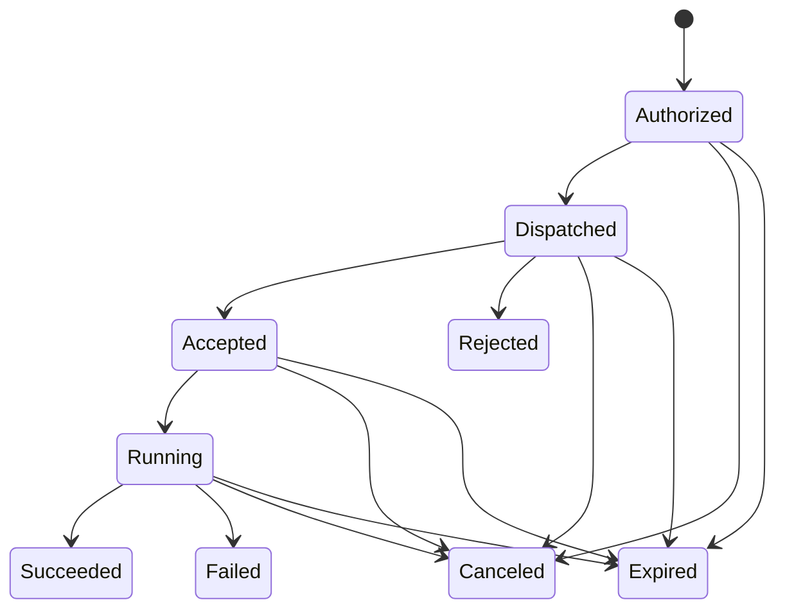

# MGA Device Protocol v1

- **Status:** Accepted; foundation implemented
- **Date:** 2026-07-13
- **Depends on:** [ADR-0001](0001-mga-client-architecture.md)

This document defines the first server-to-client contract. The shared Go wire
types live in `protocol/device/v1`; the server and client import that module
without importing each other's implementation packages.

## Implemented foundation

The current development implementation includes:

- optional password/PIN profile credentials, HttpOnly sessions, the forced
  `changeme` bootstrap change, and local-only initial credential setup
- migrations 11 and 12 for credentials, sessions, endpoints, grants, pairing
  challenges, and command audit records
- single-use ten-minute pairing codes and atomic Owner-grant creation
- Ed25519 challenge/response WebSocket authentication and per-user Windows
  DPAPI key storage
- heartbeat presence, endpoint/user metadata, explicit profile grants, and the
  ready/busy/offline/update-required/error UI mapping
- allow-listed endpoint, `inventory.refresh`, `game.install_archive`,
  `game.uninstall`, and `game.launch` commands with persisted
  lifecycle/results, endpoint-bound result validation, and capability checks
- bounded storage/runtime inventory reported at connection, every 15 minutes,
  and through the manual command using the same client collector
- transactional ZIP/7z/RAR staging/extraction, separate Download/Install
  progress, schema-2 launch discovery, installed-state persistence,
  candidate-constrained native launch, and manifest-guarded
  schema-1/schema-2 uninstall
- per-user Windows build/installer scripts, `mga://pair`, signed short-lived
  `mga://start` browser association, login startup, diagnostics, single-instance
  enforcement, and local unpairing

This is the secure control-plane plus first mutating-game vertical slice.
Game stop, non-ZIP installers, emulator management, elevation helpers,
durable reconnect idempotency, explicit cancellation messages, and client
self-update remain intentionally deferred.

## Goals

- Pair one per-user MGA Client endpoint with an authenticated MGA profile.
- Let the server accurately show whether an authorized endpoint is connected,
  ready, busy, incompatible, or in error.
- Dispatch only typed and authorized machine-local operations.
- Return acknowledgement, progress, cancellation, and terminal results.
- Survive connection loss without duplicating a mutating operation.
- Allow server and client releases to remain compatible across a documented
  protocol range.

## Non-goals

- Arbitrary shell or executable commands.
- Permanent administrative execution.
- Direct browser-to-client networking.
- Offline command queues or scheduling in v1.
- Treating a host name or hardware fingerprint as an authorization identity.

## Identifiers

| Identifier | Created by | Purpose |
|---|---|---|
| `profile_id` | Server | Authenticated MGA identity requesting or receiving access |
| `endpoint_id` | Server during pairing | Authoritative command target |
| `client_instance_id` | Client installation | Correlates local state before and after pairing |
| `connection_id` | Server per WebSocket | Identifies one live connection |
| `message_id` | Message sender | Deduplicates protocol messages |
| `command_id` | Server | Correlates the complete command lifecycle |
| `idempotency_key` | Server | Prevents duplicate local mutation after retry/reconnect |

Host name, OS user display name, platform, architecture, and installation facts
are endpoint metadata. They are not credentials and do not replace
`endpoint_id`.

## Browser launch and endpoint association

The custom protocol wakes or identifies the client; it is not a presence test
and is never the command transport. An authenticated web profile creates a
two-minute, process-local launch challenge. The web interface opens
`mga://start` with the server URL, challenge ID, and single-use random token.
The installed per-user client rejects a server different from its paired
server, signs the challenge with its endpoint key, and redeems it over HTTP or
HTTPS, according to the server URL selected during pairing.
The server verifies both the signature and the profile's endpoint grant before
revealing the endpoint ID to that browser flow. Live WebSocket state—not custom
protocol invocation—then controls the top-bar status color.

Launch challenges intentionally do not survive a server restart. The URI has no
reusable credential and cannot carry an arbitrary executable or device command.

## Pairing

1. An authenticated profile asks the server to create a single-use pairing
   challenge with a short expiry.
2. The web interface invokes `mga://pair` with an opaque challenge reference or
   shows a manual code. No reusable endpoint credential is placed in the URI.
3. The client displays the target server and profile and requires local user
   confirmation.
4. The client generates an Ed25519 key pair. On Windows, its private key is
   stored using current-user DPAPI protection.
5. The client sends the challenge reference, public key, instance ID, and basic
   endpoint metadata to the server over HTTP or HTTPS. HTTP is intended only
   for trusted LAN deployments.
6. The server atomically consumes the challenge, creates the endpoint, and gives
   the pairing profile an `Owner` grant.
7. The server returns the endpoint ID and protocol compatibility policy. The
   private key never leaves the endpoint.

Pairing fails fast if the challenge is expired, already consumed, belongs to a
different authenticated pairing flow, or requests an unsupported protocol.
Re-pairing creates or explicitly replaces an endpoint; it must not silently
take over an existing endpoint identity.

## Connection authentication

1. The client opens an outbound WS or WSS connection and sends a `hello` containing
   endpoint ID, client version, protocol range, and capabilities.
2. The server returns a fresh random authentication challenge.
3. The client signs the challenge plus connection context with its endpoint
   private key.
4. The server verifies the signature against the paired public key and either
   accepts the connection or closes it with a typed reason.
5. The server returns the selected protocol version, heartbeat interval,
   compatibility status, server time, and connection ID.

Only one authoritative live connection is allowed per endpoint. A replacement
connection supersedes the old connection explicitly; simultaneous connections
must never execute the same command independently.

## Common message envelope

Every WebSocket message uses a versioned JSON envelope:

```json
{
  "protocol_version": 1,
  "type": "command.request",
  "message_id": "01J...",
  "correlation_id": "01J...",
  "sent_at": "2026-07-13T12:00:00Z",
  "payload": {}
}
```

Required envelope fields are validated strictly. Unsupported protocol versions,
unknown message types, malformed timestamps, duplicate message IDs with
different content, and payloads that fail their typed schema produce protocol
errors. Secret material and raw local credentials are never valid payloads.

## Heartbeat and presence

The client sends a heartbeat at the server-selected interval. A heartbeat
contains:

- current client and protocol versions
- readiness and active-command count
- capabilities and capability revisions
- update status
- summarized local-action requirements
- last processed command/message positions needed for recovery

The server owns the externally visible presence decision. Missing enough
heartbeats closes the logical connection and marks the endpoint offline. The UI
uses the accepted state mapping from ADR-0001: green ready, amber busy, gray
offline, purple update required, and red error.

## Command lifecycle



The server creates a command only after checking the authenticated profile's
endpoint grant and the endpoint's advertised capability. The request contains:

- command ID and idempotency key
- typed command name and schema version
- issuing profile and validated authorization context
- creation and expiry timestamps
- normalized parameters
- whether local interaction or elevation may be requested

The client first validates the envelope, expiry, command schema, authorization
context, local capability, and idempotency record. It then returns `accepted` or
a typed rejection before performing work. Progress messages are monotonic and
terminal results are durable enough to be replayed after reconnect.

`command.progress` retains the optional overall `percent` field and may also
carry `stage` plus `stage_percent`. Stage percent is independently validated
from 0 through 100 and requires a non-empty stage. Archive installation uses
`download` and `install`; clients derive both values from actual transfer and
filesystem work rather than UI simulation.

An endpoint that is offline causes an interactive request to fail immediately.
The server may record that failed attempt for audit purposes, but it does not
dispatch it later. Scheduled/offline queues require a future protocol decision.

## Initial command families

Exact payloads remain part of the protocol-contract implementation, but v1
reserves these typed families:

| Family | Examples | Minimum grant |
|---|---|---|
| Endpoint | refresh capabilities, collect diagnostics | `View` or `Manage`, depending on sensitivity |
| Client process | stop the current per-user agent | `Manage` |
| Inventory | `inventory.refresh`; bounded storage/runtime report | `Manage` |
| Game | `game.launch` implemented; stop reserved | `Play` |
| Game management | ZIP/7z/RAR archive install/uninstall implemented; repair and executable installers reserved | `Manage` |
| Emulator | install, uninstall, configure, validate | `Manage` |
| Client | check update, apply update, restart | `Owner` |

Each concrete command is independently allow-listed. A generic `shell`, `exec`,
or unrestricted process-start command is forbidden.

### Accepted next command family: GOG Inno Setup

ADR-0007 defines the next typed family; its foundation is committed in
`1e59e51`, while the locked completion/cleanup revisions and packaged
verification remain incomplete:

- `game.install_gog_inno`, schema 1, requires `Manage`;
- `game.uninstall_gog_inno`, schema 1, requires `Manage`;
- `game.cleanup_gog_inno_failed`, schema 1, requires `Manage`.

The install request identifies one server-resolved signed GOG `setup_*.exe`,
zero or more matching `setup_*-N.bin` companions, game/source identity, and
destination. Every package file has a typed basename/role/size,
origin-relative transfer path, and bearer token. The payload has no arbitrary
local path, URL origin, arguments, environment, working directory, shell,
script, prerequisite, or confirmation-bypass field. All transfer tokens are
redacted from audit persistence.

After download, the client must verify GOG Authenticode identity and Inno Setup
family. The authenticated Manage-authorized web Install action is the consent
boundary; MGA Client does not show a second install-confirmation popup.
Invocation uses only the fixed Inno flags recorded in ADR-0007. Normal launch is
attempted first; one validated `ShellExecuteEx` `runas` retry may request Windows
UAC when required. No general elevation helper is introduced.

Download uses real aggregate byte progress. Native installer execution is
indeterminate rather than a fabricated percentage. Exact exit
`0xC000041D` may be accepted only with the bounded success-log sentinel and full
post-install validation defined by ADR-0007; raw exit and completion basis stay
in result/audit.

Executable uninstall is a separate typed command constrained to the recorded
schema-3 manifest and relative Inno uninstaller target. It never uses archive
folder deletion.

A true post-start failure with a valid schema-1 cleanup marker enters
`cleanup_required`. Cleanup is a separate typed user-selected command:
publisher uninstaller first; if no uninstaller exists or successful uninstall
leaves files, a no-follow deleter may remove only the exact marked destination.
Uninstaller failure preserves files. Server-side **Ignore** records
`ignored_failure` without dispatch or filesystem mutation. Standalone
prerequisites remain out of scope. Native destructive confirmation remains for
uninstall/cleanup; removing it is a separate decision.

## Local interaction and elevation

A command may return `user_action_required` with a safe, typed reason such as
confirmation, closing a running application, or approving UAC. The web
interface can explain that state, but it cannot simulate local consent.

If elevation is required, the non-elevated agent starts a narrowly scoped,
signed helper for that one operation and the OS user must approve it locally.
The helper receives a constrained operation description, not a shell command or
general client credential. The precise helper design requires its own security
review before implementation.

ADR-0007 does not introduce an MGA helper: after authenticated web install
consent, GOG signature/family validation, and local destructive confirmation
for uninstall/cleanup, the signed publisher installer/uninstaller itself is the
one constrained `ShellExecuteEx` `runas` target. Any MGA-owned elevated helper
remains deferred.

## Cancellation, reconnect, and deduplication

- Cancellation is best effort and produces a terminal result describing what
  was or was not rolled back.
- Reconnection never makes an unknown command safe to repeat automatically.
- The client stores idempotency outcomes for mutating commands for a bounded,
  protocol-defined period.
- The server can request the terminal result for a known command after
  reconnect.
- A duplicate idempotency key with different command content is a hard protocol
  error.
- Commands stop or fail explicitly when their expiry or local safety boundary
  is reached.

## Compatibility and update-required mode

Both sides advertise minimum and maximum protocol versions. The server selects
the highest mutually supported version. With no overlap, the client may remain
connected only in restricted update/recovery mode.

The server can set `update_required` when a client is below the supported client
version even if the transport protocol still overlaps. In that mode:

- presence remains visible as purple
- heartbeat, diagnostics, unpair, and update/recovery messages remain available
- ordinary game, inventory, installation, and emulator commands are rejected
- the UI displays the required version and actionable reason

## Audit and sensitive data

The server records the profile, endpoint, command type, timestamps, lifecycle,
and sanitized result. The client records enough local history for diagnostics
and idempotency. Neither side logs private keys, pairing secrets, access tokens,
store credentials, full environment dumps, or command payload fields marked as
sensitive.

## Deferred decisions

1. Exact schemas and local safety rules for repair, game stop, launch
   arguments/working-directory overrides, installer families beyond the
   ADR-0007 GOG Inno slice, storefront delegation, and emulator commands.
2. Durable client idempotency retention and reconnect replay for mutating
   commands.
3. Cancellation and rollback semantics for each mutating command.
4. The narrowly scoped elevation-helper design and signing policy.
5. Signed client update manifests, minimum-client-version policy, Authenticode,
   and restricted update/recovery mode.
6. Whether non-authoritative physical-host display grouping is useful.
7. A typed installation-reconciliation report/command for detecting managed
   directories, manifests, or executables removed outside MGA. Connection-time,
   periodic, and manual checks must share one client filesystem validation path;
   the server retains history and distinguishes missing from needs-repair.

## Migration impact

Server migration 11 adds `profile_credentials` and `auth_sessions`. Server
migration 12 adds `device_endpoints`, `device_grants`,
`device_pairing_challenges`, and `device_commands`. Both are additive and leave
existing profiles, libraries, integrations, and settings intact. The first
profile with the administrator role receives the `changeme` bootstrap credential
only when no credential exists, independent of its display name. Profiles
without a credential remain passwordless. Protected profiles verify their
password or PIN during profile selection, before the web interface opens.
The trusted-LAN credential policy is intentionally simple: passwords accept any
four or more characters, while PINs accept four or more digits with no maximum
length or additional composition rules.

Migration 14 adds the additive `device_inventories` snapshot table. See
[ADR-0005](0005-device-inventory-and-game-availability.md) for its bounded
schema, automatic/manual shared collector, and compatibility behavior.

Migration 15 adds command progress columns and `device_game_installations`.
Migration 16 additively adds command stage/stage-percent fields and per-install
launch target/candidate fields. Existing migration-15 rows remain valid with
empty launch metadata. New directories carry manifest schema version 2;
schema-1 directories remain uninstallable but require reinstall before launch.
See [ADR-0006](0006-managed-archive-installation.md).

Dirty-worktree migration 17 adds executable-install family/state, package files,
uninstaller target, and verification metadata. It has already been applied to
the real development database and must not be edited.

The locked failed-cleanup/Ignore revision requires additive migration 18 for
cleanup marker/Ignore metadata and `device_installation_events`. See ADR-0007
for exact columns, states, events, upgrade tests, and legacy no-marker behavior.

The new client has no legacy installation state. Its initial persisted JSON is
explicitly schema version 1; unknown future versions fail fast. No existing MGA
server JSON/config format is changed.
