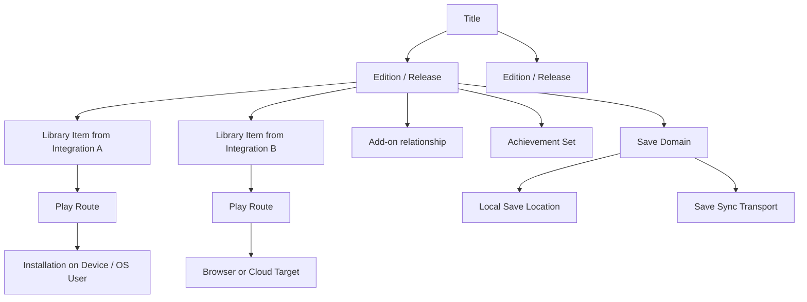

# Unified Library, Play, Installation, and Save Plan

- **Status:** Working design
- **Date:** 2026-07-14
- **Scope:** MGA Server, web interface, integrations, and per-user MGA Client

## Why this document exists

MGA is becoming a web-first, multi-storefront game library with device-aware
installation and play. It combines ideas found in storefront launchers, mixed
ROM libraries, LAN game distribution, browser emulation, and local collection
managers without pretending that every copy, edition, add-on, or play method is
the same thing.

This document preserves the agreed product and architecture direction before
implementation begins. Precise names in this document are internal domain
language. The normal web interface must use the player-facing language defined
in [player-facing-language.md](player-facing-language.md).

Implementation status: the first library/play UI foundation, version-aware
identity, bounded device inventory, and managed ZIP/7z/RAR installation slices
are now implemented. See ADR-0004 through ADR-0006. A future profile-owned **My
Settings** group will hold `%USERPROFILE%\Games` and other player preferences,
with endpoint and per-action overrides where the target filesystem matters.

## Product direction

MGA should answer four simple questions for a player:

1. What games do I have access to?
2. Where did each game come from?
3. How can I play it here or on another device?
4. Are my progress, achievements, and saves available and protected?

The Library is the complete collection and organization surface. Play is the
action-oriented surface for games that have a usable play method. Settings
configures connections, profiles, devices, storage, and application behavior;
it should not become the primary place for ordinary library work.

## Locked principles

### A source is not a play method or a device

These concepts must remain independent:

- A **library source** says where MGA learned about or obtained a copy.
- A **play route** says how that copy can be played.
- An **execution target** says where the play route will run.

For example, a game found in Google Drive may be playable in the browser, by a
local emulator on a paired PC, or after installation as a native Windows game.
An Xbox library item may expose native installation, cloud play, or neither.

The UI must not infer one concept from another merely because they often occur
together.

### Preserve real variants instead of flattening them

One source may contain several legitimate records for what a person casually
calls the same game. Examples include:

- a Sega release and a Nintendo release of Double Dragon;
- Japanese and World Nintendo releases;
- an Xbox `Goat Simulator for Windows 10` entry and another Xbox
  `Goat Simulator` entry;
- a base game, expansion, DLC, soundtrack, or installer bundle.

MGA may group related content for browsing, but it must not destroy the
identity of concrete releases and source records. When grouping by an
integration, a game present in Steam and Xbox appears in both groups.

Automatic identity resolution should prefer under-merging to silently merging
incompatible releases. A player can deliberately combine or separate items
through a review workflow.

### Capabilities compose

An integration is a configured service instance which can expose one or more
capabilities. It is not permanently assigned to one exclusive category.

Current examples already prove this model:

| Integration or plugin | Current capabilities |
|---|---|
| Steam source | Library discovery and achievements |
| Xbox source | Library discovery and achievements |
| Google Drive game source | File discovery, browsing, deletion, and local preparation |
| SMB game source | File discovery, deletion, and local preparation |
| Metadata providers | Game information and media lookup |
| Google Drive settings sync | MGA settings backup and restore |
| Google Drive save sync | Save-file storage and transfer |
| Local Disk save sync | Save-file storage and transfer |

Future capabilities can include entitlement refresh, native installation,
emulator discovery, cloud play, prerequisite handling, save discovery, and
update management. Plugin protocol names remain internal diagnostics.

### Save compatibility is explicit

MGA must never assume that two releases share compatible saves solely because
they resolve to the same title. Save compatibility may depend on platform,
region, edition, build, emulator/core, storefront, mod state, or save format.

Save Sync is cross-cutting: it connects a save domain, a player profile, one or
more local save locations, and a storage transport. It is not merely a property
of a storefront or a device.

### Casual by default, inspectable when needed

The default experience is written for a player, not a developer. Provenance,
provider evidence, resolver diagnostics, file paths, capability names, and
protocol facts remain available in an Advanced or troubleshooting surface.
They should not dominate ordinary browsing or settings.

## Domain model

The names below are architectural. User-facing names may be simpler.

### Title

The recognizable game concept used for search, artwork, descriptions, and
high-level browsing. A Title can relate several releases without erasing their
differences. A franchise or series is separate metadata, not a Title.

### Edition or Release

A concrete playable identity. It can distinguish platform, storefront edition,
region, language, release type, remaster, version, or another compatibility
boundary. Exact fields should be introduced only when reliable evidence exists;
unknown values are valid.

### Library Item

A concrete record contributed by one configured integration. It retains source
identity, provider identifiers, availability, files, entitlement facts, and
last-seen state. Two Library Items may refer to the same Edition without
becoming the same record.

### Content relationship

Relates a base game to DLC, an expansion, an episode, a soundtrack, bonus
content, or an installer bundle. Content type is not inferred only from a loose
title match. Uncertain content stays in review.

### Play Route

A typed way to play a specific Edition or Library Item. Initial route families
are:

- browser emulator;
- local emulator;
- native installed game;
- storefront launch;
- cloud or remote play.

A route declares requirements, target compatibility, preparation steps, and
availability. One Edition may have several routes at the same time.

### Execution Target

The place a route runs. A local MGA endpoint represents physical host context,
OS user, and MGA Client installation as defined by ADR-0001. Browser and cloud
targets do not need to pretend to be device endpoints.

### Installation

The state of one installable Library Item or Edition on one device endpoint.
It includes state, location, selected route/runtime, required disk space,
prerequisites, progress, errors, installed version, and update availability.
Installations are never global facts about a game.

### Achievement Set

Provider- and release-aware achievement data. A Title can display several sets,
such as an arcade set and a console set, without combining incompatible
progress.

### Save Domain

The compatibility boundary for save data. It relates compatible releases,
emulators, or builds only when MGA has evidence or an explicit player decision.
A Save Domain can have several local locations and one or more sync snapshots.

### Integration Instance

A profile-owned configuration of a plugin or built-in service. It exposes
capabilities and connection status. The same plugin can be configured more than
once, and a single instance can provide several capabilities.

## Core flows

### Scan and reconcile

Manual `Rescan all` and automatic scans continue through the shared coordinator
defined by ADR-0002.

1. Each source returns an authoritative snapshot or an explicit failure.
2. MGA creates or updates Library Items without discarding source identity.
3. Missing records become unavailable or no-longer-found; a failed source does
   not empty the library.
4. Identity resolution proposes a Title and Edition.
5. Confident matches update the library; uncertain or suspicious records enter
   Library Review.
6. Changed availability updates Play Routes and affected device/install facts.

### Identity and review

Review is not simply duplicate deletion. It supports these decisions:

- these are copies of the same Edition;
- these belong to the same Title but are different Editions;
- these are unrelated games;
- this is DLC or another add-on for a base game;
- this is not game content;
- MGA needs more information and should leave it unresolved.

Existing source records and files remain traceable after a review decision.

### Choose how and where to play

1. MGA gathers available routes for the selected Edition or Library Item.
2. It evaluates the current browser and authorized device endpoints.
3. It shows immediately usable routes first.
4. It shows understandable preparation actions for other routes, such as
   Install, Download for browser play, Connect device, or Sign in to Xbox.
5. The player chooses a route when several are valid. MGA may remember a
   profile-specific preference without hiding alternatives.
6. Progress and failures remain visible in the web interface.

Browser play and local-emulator play may both use the same source files, but
they remain separate routes with different targets and save locations.

### Install and uninstall

The server authorizes and coordinates; the per-user MGA Client performs local
work.

An installation plan must fail fast before mutation when it can already prove
that the device is offline, incompatible, lacks disk space, needs an unavailable
runtime, or lacks permission. It then reports stages such as:

- checking the device;
- preparing or downloading files;
- verifying content;
- installing prerequisites;
- installing or configuring the game;
- creating the play route;
- completed, cancelled, or failed.

Commands are typed and idempotent. Elevation is requested only for the specific
local step that requires it; the client does not permanently run as an
administrator. Uninstall must preview what will be removed and distinguish game
files, shared prerequisites, user saves, and MGA cache data.

Managed installation state must eventually reconcile with the endpoint
filesystem. If a user deletes or changes an installation outside MGA, the
client reports it through one shared connection-time, periodic, and manual
validation path. A missing directory/manifest becomes **Missing**; a present
directory with missing managed files or launch target becomes **Needs repair**.
Play is disabled, history is retained, and the UI offers Reinstall, Repair, or
Forget without deleting unrelated files or saves. This reconciliation is
planned, not implemented, and requires a typed protocol addition plus a
versioned server migration.

### Save discovery and sync

1. A route or integration proposes local save locations and a Save Domain.
2. The client inspects only authorized locations for its OS user.
3. MGA compares local and remote snapshots using timestamps plus content
   identity; timestamps alone do not silently overwrite data.
4. An unambiguous newer snapshot can follow the configured policy.
5. Divergent changes create a visible conflict with backup and choice.
6. Every transfer reports game, device/user, direction, time, and result.

The first implementation may be conservative and manual. Correct conflict and
compatibility behavior is more important than invisible automation.

## Library and Play experience

### Library

Library is the complete collection. View and Group are separate controls.

Suggested views:

- Covers: visual browsing with a small number of high-value badges;
- Details: covers plus availability and metadata;
- Table: dense management, sorting, and bulk actions.

Suggested groupings:

- none;
- platform;
- connection or storefront;
- play method;
- installed device;
- achievements;
- release year.

Grouping by integration is intentionally overlapping. A Title with Steam and
Xbox Library Items appears in both groups. Counts and filters must state whether
they count Titles, Editions, or Library Items when ambiguity matters.

Sorting must be server-stable across pagination. Loading another page must not
reorder games already displayed.

### Play

Play is a curated action surface, not a second complete Library. Its shelves may
overlap because each answers a different player question:

- Continue playing;
- Ready in this browser;
- Installed on this device;
- Play with a local emulator;
- Cloud play;
- Recently added;
- Favorites.

A game can appear in several shelves when it has several valid routes. Installed
and browser-play are route filters, not mutually exclusive game types.

### Badges

Cover cards should prioritize information needed to decide what happens after a
click. Candidate badge families are:

- playable now;
- installed, including target device when relevant;
- browser play;
- cloud play;
- update available;
- achievements;
- save sync state;
- integration/storefront identity.

Cards must not become a wall of icons. Show the highest-value two or three
signals on covers, with the full set in Details/Table views and the game page.
Every icon needs accessible text and an understandable tooltip.

## Settings and library-management boundaries

Recommended settings organization:

- **Connections:** storefronts, game locations, game-info services, and sync;
- **Devices:** paired device/user endpoints, access, presence, and client update;
- **Profiles:** player identity, credentials, role, and profile preferences;
- **Scanning:** automatic schedule, scan history, and source health;
- **Storage:** artwork/video cache, prepared source files, install packages, and
  save backups;
- **Appearance:** theme and display preferences;
- **Updates:** MGA Server/web and MGA Client compatibility;
- **Advanced:** plugins, protocol diagnostics, and developer-oriented evidence.

Unidentified content and duplicate/version review are library work, not settings.
They should eventually move to a discoverable **Library Review** surface, while
Settings may retain a link and outstanding-item count.

## Relationship to current MGA behavior

The existing implementation already provides useful foundations:

- plugin-declared source, metadata, achievements, settings-sync, and save-sync
  capabilities;
- profile-owned integrations and automatic scan settings;
- source records, file roots, content kind, and manual DLC/add-on review;
- canonical grouping plus manual split/merge pins;
- media cache and source-materialization cache as distinct storage concerns;
- provider-aware achievement sets;
- per-user device endpoints, grants, command state, and client compatibility.

The plan evolves these foundations. It does not require discarding provenance or
replacing the plugin system.

## Delivery stages

The order below keeps visible improvements moving while protecting the future
model.

Implementation status as of 2026-07-14: stage 1 is complete locally, the
first conservative vertical slice of stage 3 is implemented, and the device
inventory portion of stages 2/4 is implemented. The
Library now has stable server-side sorting, separate View and Group controls,
overlapping connection/play-method groups, high-value cover badges, and saved
profile preferences. Play has action-oriented browser and cloud shelves.
Settings uses compact player-facing cards with technical details progressively
disclosed. `NO_MIGRATION_NEEDED`: this stage adds no SQLite schema; the new
group preference is an optional field in the existing extensible frontend
configuration and safely defaults for existing installs. Migration 13 adds
profile-owned Titles and canonical-ID-compatible Editions, records accepted
provider evidence, and removes title-only automatic merging. The locked rules,
compatibility behavior, and rollback path are recorded in
[ADR-0004](0004-version-aware-game-identity.md). Content relationships and the
full Library Review workflow remain later stage-3/stage-6 work.
Migration 14 adds bounded per-endpoint storage/runtime snapshots, automatic and
manual refresh through shared client code, and per-game device readiness facts
as specified by [ADR-0005](0005-device-inventory-and-game-availability.md).

1. **Vocabulary and UI foundation:** introduce player-facing wording, stable
   server-side ordering, progressive disclosure, compact action hierarchy,
   view/group separation, badges, and saved profile preferences.
2. **Read model:** expose explicit source, availability, play-route,
   achievement, save, and device facts without yet attempting all mutations.
3. **Version-aware identity:** introduce Title, Edition, Library Item, and
   content relationships with a versioned database migration and compatibility
   layer for existing canonical IDs.
4. **Device play and installation:** add route resolution, inventory, install
   plans, progress, prerequisites, disk checks, uninstall previews, and update
   state.
5. **Save domains:** add explicit compatibility, client-side save discovery,
   snapshots, conflict handling, and transport-backed sync.
6. **Library Review:** replace title-only duplicate cleanup with edition- and
   content-aware review, preserving source evidence.

Each stage should ship as small vertical slices. A new command family requires
its server authorization, protocol contract, client implementation, progress
events, error model, tests, and player-facing UI together.

## Decisions still required before their implementation stage

- Whether user-created collections contain Titles, Editions, Library Items, or
  a deliberate mixture.
- The default play-route preference order and whether it is global,
  profile-specific, or remembered per game.
- The first native installer/package formats and prerequisite types supported by
  the client.
- The default save conflict policy and retention count.
- Whether save-domain compatibility can be community/provider supplied or only
  MGA-maintained and user-confirmed in the first version.
- Which badges are enabled by default in Covers view and how player preferences
  roam between browsers.

These are decision points, not permission to guess during implementation.

## Persistence and migration

Version-aware identity uses migration 13 as specified by ADR-0004. Existing
canonical IDs become Edition IDs, preserving URLs and dependent data. No
persisted JSON/configuration, browser storage, settings-sync payload, or
save-sync payload changes are required for this slice. Installations, Play
Routes, Save Domains, content relationships, and future persisted preferences
still require their own explicit migration decisions.
